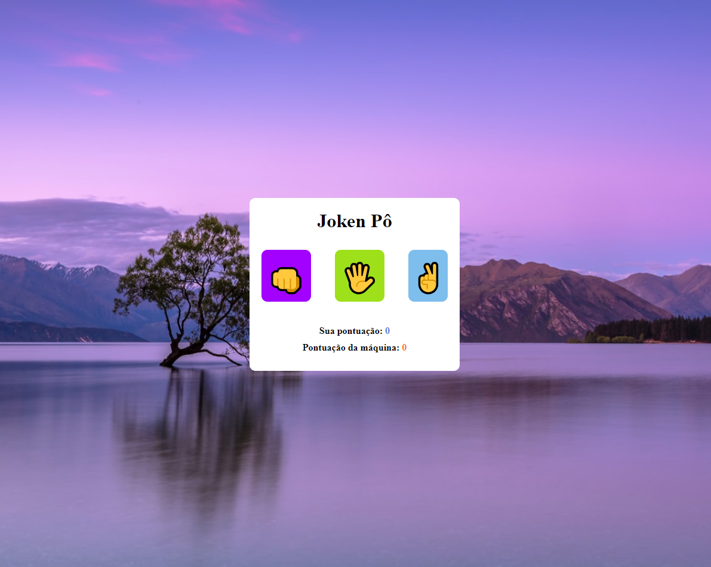
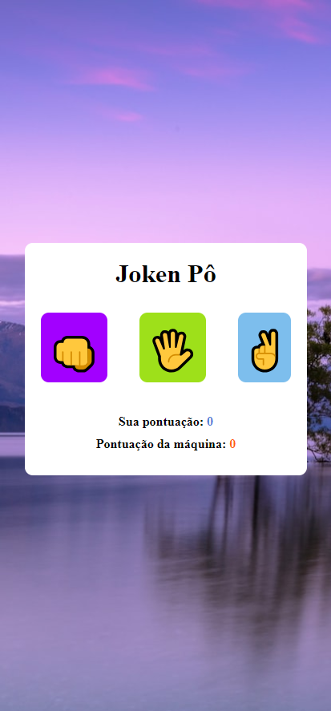

# Joken Pô
Este repositório contém o projeto do jogo comumente conhecido Joken Pô. O objetivo do projeto foi criar uma aplicação simples usando funções e laços de repetição para testar condições, com a linguagem JavaScript, HTML e CSS.

🔗 [Click here to access](https://n4ju15.github.io/joken_po/)

## Para Desktop

## Para Mobile

## Tecnologias

- HTML
- CSS
- JavaScript
- Git and Github

